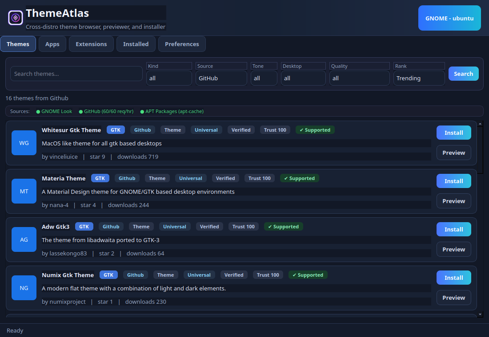

# ThemeAtlas

ThemeAtlas is a cross-distro Linux desktop theming tool with a Qt GUI and CLI.
It helps you discover, install, apply, and manage themes and related desktop customization packages from multiple sources.



## Project Status

ThemeAtlas is actively maintained and suitable for daily use on Linux desktops.
The primary tested desktop is GNOME.

## Quick Start

```bash
python3 -m venv .venv
source .venv/bin/activate
pip install -r requirements.txt
python3 main.py gui
```

## Table of Contents

- [Features](#features)
- [Compatibility](#compatibility)
- [Requirements](#requirements)
- [Installation](#installation)
- [Usage](#usage)
- [Troubleshooting](#troubleshooting)
- [Development](#development)
- [Packaging](#packaging)
- [Release](#release)
- [Security](#security)
- [Contributing](#contributing)
- [Support](#support)
- [Roadmap](#roadmap)
- [License](#license)

## Features

- Unified search across multiple sources (GNOME Look, GitHub, distro package sources)
- Install support for archives and distro package records
- Variant selection for themes with multiple downloadable files
- Preview pipeline with real image fallbacks before generated preview
- Installed manager with grouped tabs and per-item actions
- Extension visibility and enabled or disabled detection
- Compatibility filtering based on the current environment
- Rollback-safe apply checkpoints when apply fails
- CI, automated tests, and release workflow

## Compatibility

| Component | Status |
| --- | --- |
| OS | Linux |
| Python | 3.10, 3.11, 3.12 |
| Desktop environment | GNOME (best supported), others may work partially |
| Package managers | apt, pacman |

Theme and app records are normalized into one install model, then filtered for compatibility with the detected distro and package manager.

## Requirements

- Python 3.10+
- Linux desktop environment (best experience on GNOME)
- Runtime tools as needed:
  - `gsettings`
  - `gnome-extensions`
  - `pkexec`
  - `apt` or `pacman` for package installs

Python dependencies are listed in `requirements.txt`.

## Installation

### Option 1: Local run

```bash
python3 -m venv .venv
source .venv/bin/activate
pip install -r requirements.txt
python3 main.py gui
```

### Option 2: Package install

```bash
pip install .
```

### Option 3: pipx install (recommended CLI path)

```bash
pipx install .
```

## Usage

### GUI

```bash
python3 main.py gui
```

For a dock or app-menu launcher:

```bash
bash scripts/install_desktop_entry.sh
```

This creates a user-local launcher at `~/.local/bin/themeatlas-launcher` and updates the desktop entry to use it.

### CLI

```bash
themeatlas --help
```

## Troubleshooting

### PySide6 import error mentioning `libEGL.so.1`

Install system OpenGL EGL runtime:

```bash
sudo apt-get update
sudo apt-get install -y libegl1
```

### Desktop launch entry not visible

Run:

```bash
bash scripts/install_desktop_entry.sh
```

Then log out and back in, or restart your desktop session.

### `themeatlas` command not found

Use one of:

```bash
pipx install .
```

or

```bash
python3 -m venv .venv
source .venv/bin/activate
pip install -e .
```

### AppImage does nothing when launched

On systems without the FUSE 2 compatibility library, desktop launchers often suppress the AppImage error and it appears to do nothing.

On Ubuntu 24.04, install:

```bash
sudo apt-get update
sudo apt-get install -y libfuse2t64
```

For a one-off test without installing FUSE, run:

```bash
./ThemeAtlas-1.0.0-x86_64.AppImage --appimage-extract-and-run
```

## Development

Run tests:

```bash
python3 -m unittest discover -s tests -p "test_*.py" -v
```

Compile check:

```bash
python3 -m compileall -q theme_manager
```

Code quality in CI runs on Python 3.10, 3.11, and 3.12.

## Packaging

ThemeAtlas includes starter packaging scaffolding for desktop distribution:

- Flatpak manifest: `packaging/flatpak/io.themeatlas.ThemeAtlas.yaml`
- AppImage staging helper: `scripts/build_appimage.sh`

Flatpak build example:

```bash
flatpak-builder build-dir packaging/flatpak/io.themeatlas.ThemeAtlas.yaml --force-clean
```

AppImage staging example:

```bash
bash scripts/build_appimage.sh
```

The AppImage helper prepares an AppDir and prints the `appimagetool` command to finish the bundle if that tool is installed.

## Release

GitHub Actions publishes releases on version tags matching `v*`.

```bash
git tag v1.0.1
git push origin v1.0.1
```

See `CHANGELOG.md` for release history.

## Security

Please review `SECURITY.md` for vulnerability reporting guidance.

## Contributing

Please review `CONTRIBUTING.md` before opening pull requests.

## Support

- Open a GitHub Issue for bugs and feature requests
- Include distro, desktop environment, Python version, and logs when reporting issues

## Roadmap

- Expand desktop environment support beyond GNOME
- Improve source quality and trust scoring
- Add richer preview and compatibility metadata
- Improve package and distro coverage

## License

Licensed under the MIT License. See `LICENSE`.
